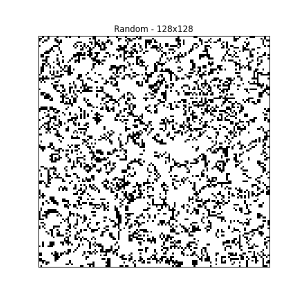
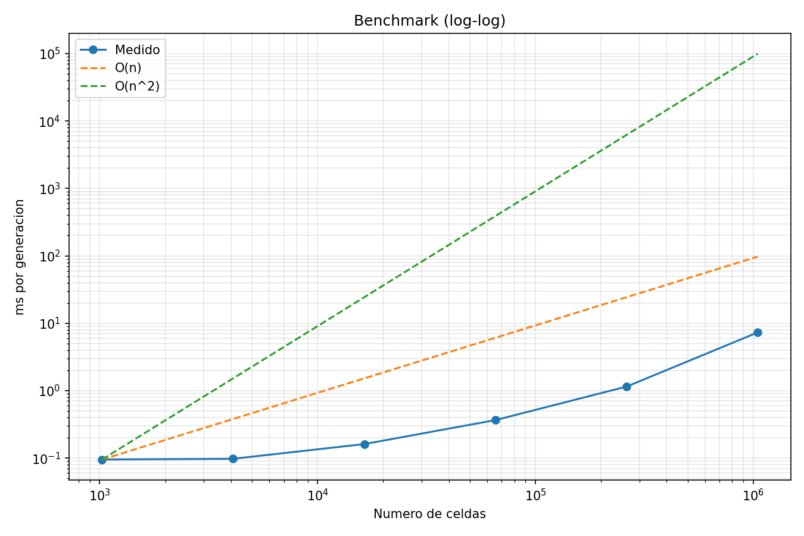

# Tarea 1 - Juego de la Vida de Conway
## Esteban Ramirez
IIC2026 - G1 - Computación Paralela y Distribuida

## Requisitos
Las librerias requeridas estan en `requirements.txt`.
- Python 3.10+
- `numpy`
- `matplotlib`

## Estructura del proyecto

```text
📁 Tarea1/
├── 📄 game_of_life.py      # Clase principal y reglas del juego
├── 📄 visualizer.py        # Genera animaciones GIF
├── 📄 benchmark.py         # Mide tiempos y genera graficas
├── 📄 requirements.txt     # Dependencias del proyecto
├── 📄 README.md            # Explicacion y uso del proyecto
└── 📁 outputs/             # Imagenes y GIFs generados
```
## Instalacion y uso
```powershell
python -m venv .venv
.\.venv\Scripts\Activate.ps1
pip install -r requirements.txt
```

### Empezar a usar
Desde la terminal puede ejecutar `python` y pegar los siguientes comandos:

```python
from game_of_life import GameOfLife

juego = GameOfLife(32, 32)
juego.run(10)
tablero = juego.get_state()
```
La parte `juego = GameOfLife(32, 32)` representa el tamaño del tablero de 32x32, estos valores se pueden personalizar.

Tambien hay patrones iniciales predefinidos:

```python
glider = GameOfLife.glider()
blinker = GameOfLife.blinker()
toad = GameOfLife.toad()
```

### Generar animaciones

Ejecutar

```powershell
python visualizer.py
```

Esto crea estos GIFs ubicados en:

- `outputs/glider_32.gif`
- `outputs/blinker_32.gif`
- `outputs/random_128.gif`

#### Generar animaciones con tableros de hasta 512
Dentro de la terminal ejecuta `python` y luego pega el siguiente comando:
```python
from visualizer import animate_game

animate_game("random", 32, 50)
```
Donde `animate_game("random", 32, 50)` representa:
- El patrón es aleatorio (valores disponibles: random, glider, blinker, toad)
- Dimension de `32x32`
- Cantidad de generaciones `50`

Ejemplo:


### Ejecutar el benchmark

Ejecutar

```powershell
python benchmark.py
```

El benchmark prueba tableros de `32, 64, 128, 256, 512 y 1024`.
Para cada tamano ejecuta 10 generaciones y muestra el tiempo promedio por
generacion.
Los resultados se pueden ver en la ruta:

- `outputs/benchmark_linear.png`
- `outputs/benchmark_loglog.png`

# Analisis de resultados

La parte del proyecto con mayor consumo de rendimiento está en la función `contar_vecinos()`, porque en cada generacion debe revisar las 8 posiciones.

Antes de continuar es importar recalcar que la cantidad de celdas se obtine de la multiplicacion de filas por las columnas. Con esto, cada celula cuenta con **8 direcciones**, el 8 es un valor fijo. Realmente el trabajo crece realmente cuando aumenta el numero de celdas en el tablero.

Se considera que el crecimiento es lineal, ya que si se duplica el valor de las celdas, se duplica el trabajo.



En la grafica de este benchmark muestra que el tiempo de ejecución crece aproximadamente de forma lineal con respecto al número de celdas del tablero. La curva experimental se mantiene mucho más cercana a la referencia O(n) que a O(n²), especialmente para tamaños grandes.

## Uso de memoria
Una celda representa a una celula (en estado viva o muerta), sin importar el estado sigue consumiendo memoria, por lo que un tablero mas grande **conlleva a usar mas memoria**.
Esto sin contar los arreglos temporales para contar los vecinos que los rodea (siendo mas consumo de memoria).

En conclusion
- Mas celdas ⇒ mas tiempo de procesamiento.
- Mas celdas ⇒ mas memoria utilizada.
- Tanto el tiempo como la memoria crecen de forma proporcional al tamaño del tablero (O(n)).

## Cuellos de botella
El mayor costo del programa está en contar los vecinos de cada celda usando funciones de NumPy. Estos calculos generan datos temporales en memoria que aumentan el tiempo de calculo. Tambien hay que incluir a la generacion de los gifs que tardan en generarse y guardarse.

## Interpretación de las gráficas


En la grafica anterior se puede ver como el tiempo de ejecucion aumenta conforme lo hace el tamaño del tablero. La curva de ejecucion está más cercana a O(n). Esto indica que el crecimiento en el tiempo de ejecucion aumenta proporcionalmente a la dimension del tablero.

